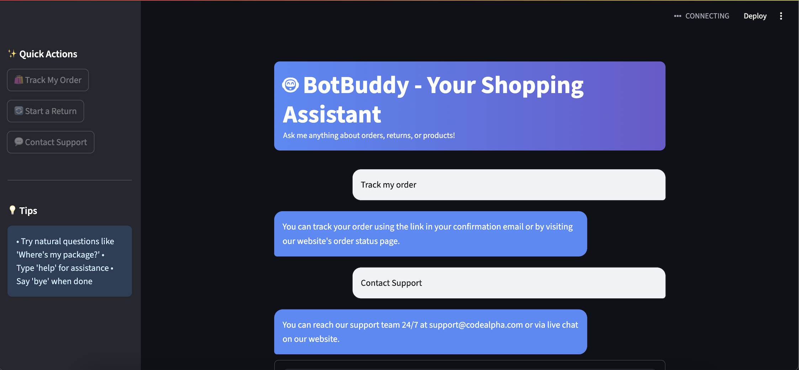

# 🤖 BotBuddy – FAQ Chatbot for CodeAlpha Internship

BotBuddy is an interactive FAQ chatbot built using **Python**, **Streamlit**, and basic **NLP techniques**. It intelligently answers customer queries about orders, returns, payments, and more — even if the questions aren't typed perfectly. Designed as part of the CodeAlpha internship project.

---

## 🚀 Features

- 💬 Smart matching of user questions to known FAQs (even with different wording)
- 🧠 Uses **TF-IDF + token similarity** for robust intent detection
- 🎨 Beautiful Streamlit UI with animations and transitions
- 📦 Sidebar with quick-action buttons
- 🎉 Confetti effect when users say thank you
- 🔁 Session-based memory for natural back-and-forth conversation

---

## 🧠 Tech Stack

- Python 3
- Streamlit
- scikit-learn
- NLTK
- pandas

